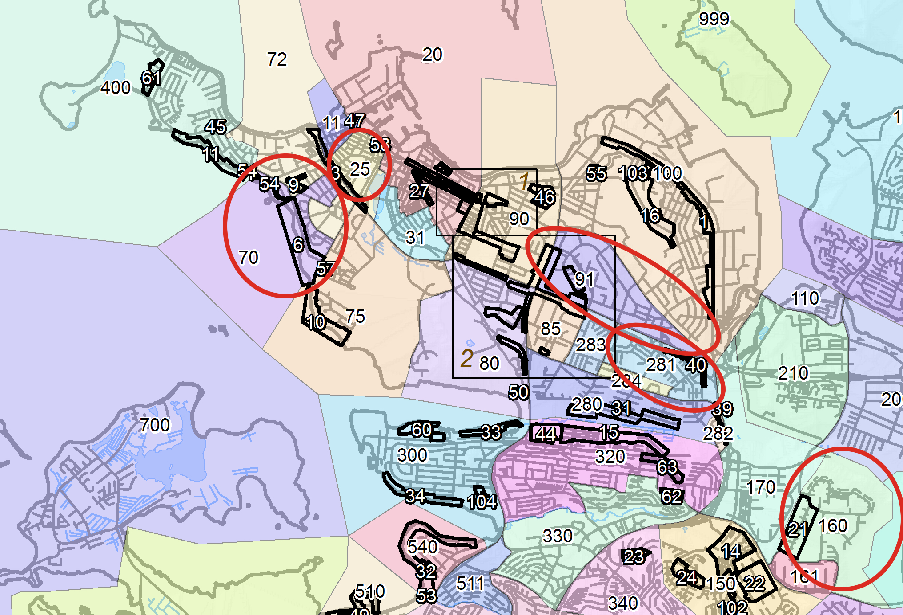

```{r setup, include=FALSE}
knitr::opts_chunk$set(echo = TRUE)
#setwd("~/Desktop/H21/Hagnýtt línuleg tölfræðilíkön/Heimadæmi/HLT-V5")
setwd("~/Documents/CS HI/2021-22/HLT/Verkefni 5")
library(MASS)
library(tidyverse)
library(GGally)
library(gplots)
library(reshape2)
library(kableExtra)
library(gtsummary)
library(knitr)
set.seed(11)

data_big <- data.frame(read.table("gagnasafn_endurmat2017_litid.csv", header = T, sep = ","))
data_big$id <- 1:nrow(data_big)
sublocations = c(25, 70, 91, 160, 281)
data = data_big[data_big$matssvaedi == sublocations, ]

inline_hook <- function(x){
  
  if(is.numeric(x)){
    formatted <- format(x, digits=2, nsmall = 2)
  } else{
    formatted <- x
  }
  paste0("**", formatted, "**") # gott til að spotta inline tölur, má svo taka út
}
knit_hooks$set(inline=inline_hook)

```

## Inngangur

Í þessu verkefni er markmið okkar að skapa líkan sem nálgar fasteignamat eigna á ákveðnum svæðum Reykjavíkur að gefnum upplýsingum um viðeigandi fasteignir. Við lýsum því hér hvaða skref við tókum í líkanasmíðinni, hvernig við völdum og höfnuðum breytum, mátum gæði líkana og bárum saman þau líkön sem komu til greina.

Gögnin sem unnið var með voru fasteignamöt eigna fyrir árið 2017, unnin árið áður. Einungis var notast við gagnapunkta af fimm svæðum innan Reykjavíkur sem sjá má á korti hér að neðan; miðbær frá Bræðraborgarstíg að Tjörn, Melar að sjó, Háaleiti og skeifan, Hólar og Berg í Breiðholti og loks Réttarholtið. Á þessum svæðum voru í heildina 433 fasteignir með 21 breytum auk núvirðis, óháðu breytunnar. Skýribreyturnar voru eftirfarandi: Fastanúmer íbúðar, Kaupdagur, Tegund eignar, Svæðisnúmer, Byggingarár, Hæð íbúðar, Fjöldi lyfta, Fermetrafjöldi, Fjöldi hæða, Fjöldi bílastæða, Fjöldi baðkara, Fjöldi sturta, Fjöldi klósetta, Fjöldi eldhúsa, Fjöldi herbergja, Fjöldi stofa, Fjöldi geymsla, Stig framkvæmdar, Matssvæði, Undirmatssvæði og Tegund íbúðar. Þær breytur sem ekki segja sig sjálfar eru; Tegund eignar, Svæðisnúmer, Stig framkvæmdar, Matssvæði, Undirmatssvæði og Tegund íbúðar. Tegund eignar skiptist í fjóra flokka; Einbýlishús, parhús, íbúð og raðhús. Tegund íbúðar aðgreinir sérbýlishús frá fjölbýlishúsum, svæðisnúmer er auðkenni sveitarfélags og stig framkvæmdar er skali frá 0 upp í 10 sem metur hvort húsnæðið sé tilbúið. Matssvæði eru hverfin sem sjást á myndinni hér að neðan og undirmatssvæði eru ákveðin svæði innan þeirra.

{width=50%}

Til að byrja með skoðuðum við gögnin, meðaltöl breyta, kvantíla og há- og lággildi ásamt því að umbreyta þeim yfir á rétt snið, svo sem kaupdegi yfir á dagsetningaform og flokkunarbreytum yfir í flokka. Einnig athugum við hvort einhver auð gildi eru til staðar. Við fjarlægjum strax fastanúmer sem breytu þar sem hún er einungis auðkenni fasteignar og inniheldur ekki upplýsingar um hana. Sömuleiðis fjarlægjum við svæðisnúmerið þar sem allar breyturnar deila svæðisnúmeri Reykjavíkur og það veitir þar með engar upplýsingar um gagnapunktana.

```{r message = FALSE}
# Fjarlægjum breytur sem augljóslega skipta ekki máli:
data <- subset( data, select = -c(svfn,rfastnum) )

# Athugum hvort auð gildi séu til staðar
if (sum(apply(data,2,is.nan))){
  print("Athuga auð gildi")
}

# Skilgreinum tegundir breyta:
data[ ,"kdagur"] <- as.Date(data[ ,"kdagur"]) # Kaupdagur sem dagsetning
data[ ,"teg_eign"] <- as.factor(data[ ,"teg_eign"]) # Tegund eignar sem flokkur

data[ ,"matssvaedi"] <- as.factor(data[ ,"matssvaedi"]) # Staðsetning sem flokkur
data[ ,"undirmatssvaedi"] <- as.factor(data[ ,"undirmatssvaedi"]) # Undirstaðsetning sem flokkur
data[ ,"ibteg"] <- as.factor(data[ ,"ibteg"]) # Tegund íbúðar sem flokkur

summary(data)
```

```{r include = FALSE}
numericNames <- colnames(dplyr::select(data, where(is.numeric)))[1:15]
#summary(data[numericNames]) %>%
#  kbl(align = 'c', col.names = c("Núvirdi",	"Byggingarár",	"Nr. hæðar",	"Fjöldi lyfta",	#"Fermetrafjöldi",	"Fjöldi hæða",	"Fjöldi bílastæða",	"Fjöldi baðkara",	"Fjöldi sturta",	"Fjöldi #klósetta",	"Fjöldi eldhúsa",	"Fjöldi herbergja",	"Fjöldi stofa",	"Fjöldi geymsla",	"Stig framkvæmdar", "ID"), row.names = T) %>% #c("Min", "1.Qt", "Median", "3.Qt", "Max")
#  kable_styling()


#library(table1)
#table1::table1(~., data[numericNames])
# Þessi er flottari en það vantar kvantíla
#library("psych")
#describe(data[numericNames])

#tbl_summary(data, include = -id, label = c(kdagur = "Kaupdagur", teg_eign = "Eignartegund", matssvaedi = "Matssvæði", undirmatssvaetdi = #"Undirmatssvæði", nuvirdi = "Núvirdi",	byggar = "Byggingarár",	haednr = "Nr. hæðar", lyfta =	"Fjöldi lyfta",	ibm2 = "Fermetrafjöldi",	#fjhaed = "Fjöldi hæða", fjbilast = "Fjöldi bílastæða",	fjbkar = "Fjöldi baðkara",	fjsturt = "Fjöldi sturta",	fjklos = "Fjöldi #klósetta", fjeld =	"Fjöldi eldhúsa",	fjherb = "Fjöldi herbergja",	fjstof = "Fjöldi stofa",	fjgeym = "Fjöldi geymsla",	stig10 ="Stig #framkvæmdar")) %>% modify_header(update = list(
#  label ~ '**Einkenni**',
#  stat_0 ~ '**N = 433**'
#)) %>% modify_footnote(update = list(
#  label ~ 'Bil, miðgildi, fjöldahlutfall'
#))
  
```

Við skiptum gagnasafninu okkar í þjálfunar- og prófunarsafn með 75% gagnapunkta í því fyrrnefnda og fjórðung í því síðarnefnda.

## 1. Fyrsta líkan

Að svo stöddu erum við tilbúnir að máta fyrsta líkanið okkar og greina það. Í fyrstu mátum við núvirði við allar þær breytur sem eftir standa.

``` {r}
# Splittum datasetti í þjálfun og prófun:
sizeTraining = floor(0.75 * nrow(data))
trainingSampleRowId <- sample(1:nrow(data), size = sizeTraining, replace = F)
train_data <- data[trainingSampleRowId, ]
test_data <- data[-trainingSampleRowId, ]

# Fittum fyrsta líkan, án nokkurrar vinnslu:
lm.first = lm(nuvirdi ~ . -id, data = train_data)
s.first = summary(lm.first)
```

``` {r include = FALSE}
test_resid = (predict(lm.first, test_data) - test_data$nuvirdi)
```
Þessi fyrsta tilraun til að máta gögnin gefur okkur líkan til að miða við héðan af, það er bara upp á við eftir þetta. Þetta líkan fær `r sqrt(mean(residuals(lm.first)^2))` í RMSE og `r s.first$adj.r.squared` í aðlagað $R^2$. Er við skoðum spágildi líkansins út frá prófunargagnasetti fæst `r sqrt(mean(test_resid^2))` í RMSE. Skoðum til viðbótar annað grunnlíkan sem mátar núvirði eingöngu við fermetraverð. Þetta líkan mætti hugsa sem grunnviðmið parsímóníunnar.

``` {r} 
lm.simple <- lm(nuvirdi ~ ibm2, data = train_data)
s.simple <- summary(lm.simple)
``` 

``` {r include = FALSE}
test_resid_simple = (predict(lm.simple, test_data) - test_data$nuvirdi)
```
Við sjáum að það fær hærra RMSE en fyrsta líkanið okkar líkt og búast má við. Þetta einfalda líkan fær `r sqrt(mean(residuals(lm.simple)^2))` í RMSE á þjálfunarsetti og `r sqrt(mean(test_resid_simple^2))` í RMSE á prófunarsetti, hvort tveggja mjög hátt.

## 2. Fækkun breyta

Byrjum á að breyta fjölda lyfta í tvíundarbreytu sem segir til um hvort það sé lyfta eður ei. Skoðum svo hvaða breytur eru línulega háðar og mega missa sín.
```{r out.width = "70%", fig.align = "center"}
data[ ,"lyfta"] <- data[,"lyfta"]>0

# Skoðum breytur sem eru of líkar, multiple collinearity:
library(gplots)
heatmap.2(cor(data[numericNames]))
```

Við sjáum þyrpingu sem sýnir mikil líkindi og skoðum eigingildin

```{r}
X <- model.matrix(lm(nuvirdi ~ ., data[numericNames]))
eigenX <- eigen(t(X) %*% X)
condNumber <- max(eigenX$values)/min(eigenX$values)
condNumber
``` 

Hér sést að þessi hópur af breytum sem sýna mikla fylgni hvor við aðra eru fermetrar, fjöldi herbergja, núvirði (óháða breytan okkar), fjöldi klósetta, fjöldi hæði og fjöldi stofa. Við skoðun á breytufylkinu sést að ástandstalan er gríðarhá og greinilegt að eitthvað sé á seyði hér. Við skoðum því þá eiginvigra með sérlega lág eigingildi.


``` {r}
eigenX$values
```
Við sjáum að eigingildi 15 er pínkulítið, skoðum það betur.
```{r}
tiny <- eigenX$vectors[, 15]
# colnames(data[numericNames])[c(5, 6, 10, 12, 13)]
# sum(tiny[c(5, 6, 10, 12, 13)])
# sum(tiny)
# plot(tiny[c(5, 6, 10, 12, 13)])
bad_actors <- tiny[c(5, 6, 10, 12, 13)]
sum(bad_actors[c(1,5)]) - sum(bad_actors[c(2,3,4)])
```

Við sjáum að fermetrafjöldi og fjöldi stofa tjá nokkurn veginn sömu upplýsingar og fjöldi herbergja, klósetta og hæða. Við ákveðum því að taka þrjár síðarnefndu út. Þegar við skoðum líkanið sem út úr því kemur sést að RMSE hækkar en aðlagað $R^2$ gerir það sömuleiðis að örlitlu leyti. 

``` {r include = FALSE}
# Tökum þessa þætti út og skoðum aftur módelið:
td2 = subset( train_data, select = -c(fjherb, fjklos, fjhaed) )
lm.second = lm(nuvirdi ~ ., data = td2)

s.second <- summary(lm.second)
# sqrt(mean(residuals(lm.first)^2))
# sqrt(mean(residuals(lm.second)^2))
```

Athugum svo að breyturnar fyrir fjölda eldhúsa og fjölda bílastæða taka nánast sömu gildi í öllum gagnapunktum. Þar að auki eru þær með mjög há p-gildi og við metum það svo að þær megi báðar fjúka. Við það breytist RMSE lítið sem ekkert en aðlagað $R^2$ hækkar.

``` {r out.width = "40%", fig.align = "center", echo = FALSE}
barplot(table(data$fjeld), main = "Fjöldi eldhúsa")
barplot(table(data$fjbilast), main = "Fjöldi bílastæða")
```

``` {r include = FALSE}
td3 = subset( td2, select = -c(fjeld, fjbilast) )
lm.third = lm(nuvirdi ~ ., data = td3)
#sqrt(mean(residuals(lm.third)^2))
s.third <- summary(lm.third)
```


## 3. Ítarlegri gagnaúrvinnsla

Athugum nú aðrar breytur þar sem ástæður til að fjarlægja þær blasa ekki jafnvel við. Við sjáum að tegund eignar og íbúðartegund kóða fyrir mjög svipuðum eiginleikum fasteignar og að parhúsarflokkurinn er sá eini í tegund eignar sem mælist með almennilega svörun, mögulega að undanskildum einbýlishúsaflokknum sem er grunnflokkurinn. Þó eru einungis 6 gagnapunktar í parhúsaflokknum og því mögulega ástæða til að fella tegund eignar inn í íbúðartegund. Skoðum hvernig gögnin liggja í þeim flokkum.

``` {r}
group_by(data, Íbuðartegund = ibteg, Eignartegund = teg_eign) %>% 
  count() %>%
  kbl() %>%
  kable_styling()
```
Hér sést að allar íbúðartegundir nr. 12 eru eignartegundin Íbúðareign. Þó eru nokkrar íbúðareignir sem falla í flokk 11 ásamt öllum hinum tegundum. Eftir samanburð á líkönum sem tóku annars vegar íbúðartegund og eignartegund út þá var það metið svo að betra væri að taka íbúðartegund út. RMSE lækkar og $R^2$ hækkar, alveg eins og við viljum. 

``` {r include = FALSE}
td4 = subset( td3, select = -c(ibteg))
lm.fourth = lm(nuvirdi ~ ., data = td4)
# sqrt(mean(residuals(lm.fourth)^2))
s.fourth <- summary(lm.fourth)
```

Önnur breyta sem mögulega er að rýra líkanið er undirmatssvæði. Skoðum hvernig gildin liggja þar.

``` {r}
group_by(data, undirmatssvaedi) %>% 
  count() %>%
  kbl() %>%
  kable_styling()
```

Hér sést að langflestir punktarnir falla í undirmatssvæði 0 og að flestir flokkar innihalda einungis örfáar fasteignir. Einu flokkarnir sem fá lágt p-gildi eru 3 og 6, sem eru Ægissíða og Vesturbær NA við Hringbraut, en einungis 7 og 4 stök falla þar undir. þar að auki virðast fjölmennustu flokkarnir, nr. 21 og 28 (Vesturberg í Breiðholti og Blokkir við Kringlumýra- og Miklubraut),  skipta litlu máli. Á hinn bóginn þá innihalda undirmatssvæði í eðli sínu færri punkta en matssvæðin og væntanlega valin af góðum ástæðum. Það er eitt að búa í Vesturbænum en annað að búa á Ægissíðunni með útsýni yfir hafið. Af þessum ástæðum ákváðum við að halda í þessa breytu örlítið lengur og sjá hvernig henni vegnar í síðari greiningu á líkönunum.

Síðar kom í ljós, eftir að veigamiklir punktar voru skoðaðir, að punktur 10944 var óeðlilega áhrifamikill og var það sökum þess að eini breytileikinn í framkvæmdarstigsbreytunni kom frá honum. Allir punktar höfðu gildi 10 í þeirri breytu nema þessi eini. Af þeim völdum fjarlægðum við þá breytu úr líkaninu. Þetta hefði mátt gerast fyrr í ferlinu.

``` {r out.width = "40%", fig.align = "center", echo = FALSE}
barplot(table(data$stig10), main = "Framkvæmdarstig")
```
```{r}
td5 = subset(td4, select = -stig10 )
lm.fifth = lm(nuvirdi ~ ., data = td5)
s.fifth <- summary(lm.fifth)
s.fifth$adj.r.squared
```

Þá er líkan með `r sqrt(mean(residuals(lm.fifth)^2))` í RMSE og `r s.fifth$adj.r.squared` í aðlagað $R^2$. 

## 4. Grunnskoðun á línuleika

Byrjum á að skoða eitt mikilvægasta plottið, leifð á móti spágildi.

``` {r}
fortData <- fortify(lm.fifth)
fortData %>%
  ggplot(aes(x = .fitted, y = .resid, color = matssvaedi, shape = teg_eign)) +
  geom_jitter(width = 0.25)
```
Hér er augljóslega tilfelli af hederoskedaticity, þ.e. leifðin eykst með hærra spágildi. Við ættum að geta séð þetta vel líka með QQ-plotti af leifðinni:

``` {r}
tibble(Normal = fortData$.stdresid) %>%
  gather(type, val) %>%
  ggplot(aes(sample = val)) +
  stat_qq() +
  geom_abline(slope = 1, intercept = 0, lty = 2, col = 'blue')
```

Gögnin halda að miklu leyti í við y = x línuna en þó er einn punktur alveg kú-kú og tilhneigingin á báðum endum er samhverf sem bendir til þess að hér sé eitthvað annað en línulegt í gangi. 

Af þessu tvennu að ofan drögum við þá ályktun að líklegt sé að við viljum umbreyta y breytunni okkar. Réttast er þó að skoða fyrst útlaga og áhrifamikla punkta vegna þess að BoxCox og aðrar aðferðir eru sérstaklega næmar fyrir slíku.

